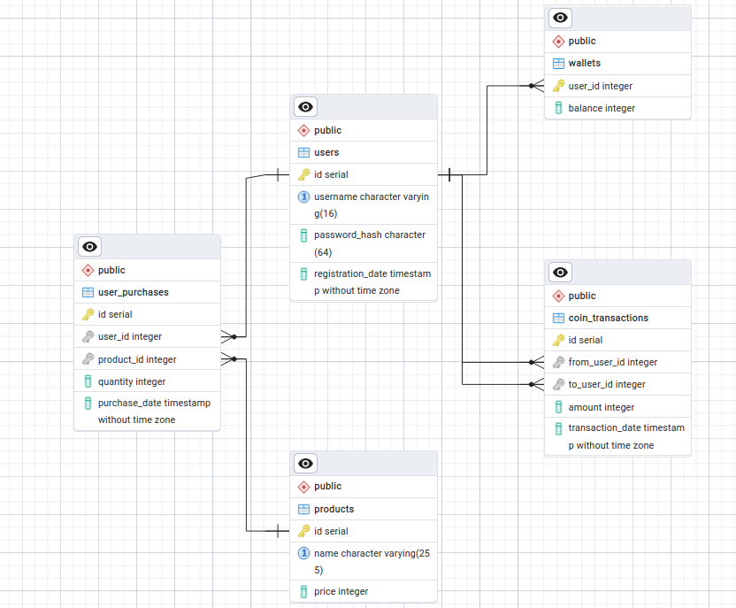

# Тестовое задание Merch Shop

При решении тестового задания буду использовать fiber, pgx

### Запуск приложения

Для запуска приложения можно использовать два подхода: с помощью docker-compose-db для запуска только
базы данных или с полным запуском приложения и базы данных с помощью обычного docker-compose.
Также необходимо создать .env файл, по структуре из .env.template

1. Установка зависимостей:

```bash
go mod download
```

2. Запуск с помощью docker-compose-db

```bash
docker-compose -f docker-compose-db.yml up -d
```

```bash
go run cmd/app/main.go
```

3. Запуск с помощью docker-compose

```bash
docker-compose up --build
```

### Архитектура базы данных

Исходя из текста задания + API я выделил следующие таблицы:

- `users` - для хранения информации о сотрудниках магазина;
- `products` - для хранения информации о доступных товарах;
- `wallets` — для хранения информации о кошельках сотрудников магазина;
- `user_purchases` — для хранения информации о покупках сотрудников;
- `coin_transactions` — для учета переводов монет между сотрудниками.

Диаграмма базы данных:
